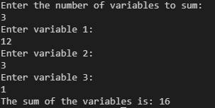

To run this Rust code in a Docker container on a Windows machine, you will need to follow these general steps:

``` docker build -t sum_variables .```

This will create a Docker image named sum_variables using the Dockerfile in the current directory

Run the Docker container: Once the image is built, you can run a container from it using the following command:

``` docker run -it --rm sum_variables ```

----


This is the example of running code


